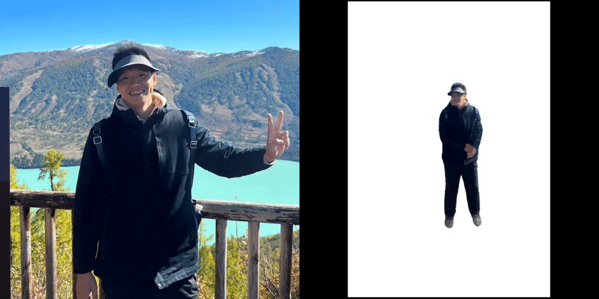

# <span> - 官方 PyTorch 实现</span>

####  <p align="center"> [Lingteng Qiu<sup>*</sup>](https://lingtengqiu.github.io/), [Xiaodong Gu<sup>*</sup>](https://scholar.google.com.hk/citations?user=aJPO514AAAAJ&hl=zh-CN&oi=ao), [Peihao Li<sup>*</sup>](https://liphao99.github.io/), [Qi Zuo<sup>*</sup>](https://scholar.google.com/citations?user=UDnHe2IAAAAJ&hl=zh-CN)<br>[Weichao Shen](https://scholar.google.com/citations?user=7gTmYHkAAAAJ&hl=zh-CN), [Junfei Zhang](https://scholar.google.com/citations?user=oJjasIEAAAAJ&hl=en), [Kejie Qiu](https://sites.google.com/site/kejieqiujack/home), [Weihao Yuan](https://weihao-yuan.com/) <br>[Guanying Chen<sup>+</sup>](https://guanyingc.github.io/), [Zilong Dong<sup>+</sup>](https://baike.baidu.com/item/%E8%91%A3%E5%AD%90%E9%BE%99/62931048), [Liefeng Bo](https://scholar.google.com/citations?user=FJwtMf0AAAAJ&hl=zh-CN)</p>
###  <p align="center"> 阿里巴巴通义实验室</p>

[](https://aigc3d.github.io/projects/LHM/)
[](https://arxiv.org/pdf/2503.10625)
[](https://huggingface.co/spaces/DyrusQZ/LHM)
[](https://www.modelscope.cn/studios/Damo_XR_Lab/LHM) 
[](https://modelscope.cn/studios/Damo_XR_Lab/Motionshop2) 
[](https://www.apache.org/licenses/LICENSE-2.0)

<p align="center">
  
</p>

## 📢 最新动态
**[2025年4月9日]** 我们开源了独立的运动提取节点和动画推理节点，利用已经提取好的运动参数，动画推理节点可以在20s内产生10s的视频!!! 参考[ComfyUI](https://github.com/aigc3d/LHM/tree/feat/comfyui) 更新你的节点！<br>
**[2025年4月9日]** 我们提供了一套详细的教程，指导大家如何在Windows系统中安装[LHM-ComfyUI-tutorial](https://github.com/aigc3d/LHM/blob/feat/comfyui/Windows11_install.md)!<br>
**[2025年4月9日]** 我们开源了整套视频处理工具来构建您自己的训练数据 [LHM_Track](https://github.com/aigc3d/LHM_Track).<br>
**[2025年4月7日]** 我们开源了另一个项目 [LAM](https://github.com/aigc3d/LAM), "单图秒级打造超写实3D数字人" <br>
**[2025年4月3日]** LHM-500M-HF & LHM-1B-HF 模型开源, 更鲁棒更快，现在支持半身图片输入啦！<br>
**[2025年4月2日]** 我们正式发布了官方的 ComfyUI 节点和自定义视频动画工作流程！🔥🔥🔥 欢迎尝试使用 [ComfyUI](https://github.com/aigc3d/LHM/tree/feat/comfyui) 分支！<br>
**[2025年3月26日]** ModelScope 开源了，快来使用我们的线上资源吧 🔥🔥🔥!<br>
**[2025年3月20日]** 发布视频动作处理脚本<br>
**[2025年3月19日]** 本地部署 Gradio<br>
**[2025年3月19日]** HuggingFace Demo：更快更稳定 <br>
**[2025年3月15日]** 推理时间优化：提速30% <br>
**[2025年3月13日]** 首次版本发布包含：  
✅ 推理代码库  
✅ 预训练 LHM-0.5B 模型  
✅ 预训练 LHM-1B 模型  
✅ 实时渲染管线  
✅ Huggingface 在线演示  

### 待办清单
- [x] 核心推理管线 (v0.1) 🔥🔥🔥
- [x] HuggingFace 演示集成 🤗🤗🤗
- [x] ModelScope 部署
- [x] 动作处理脚本 
- [ ] 训练代码发布

## 🚀 快速开始

我们提供了一个 [B站视频](https://www.bilibili.com/video/BV18So4YCESk/) 教大家如何一步一步的安装LHM. <br>
我们提供了一个 [B站视频](https://www.bilibili.com/video/BV1J9Z1Y2EiJ/) 教大家如何一步一步的安装LHM-ComfyUI.


### 从Docker中构建环境
请先确认你安装了nvidia-docker
```
# CUDA 121
# step0. download docker images
wget -P ./lhm_cuda_dockers https://virutalbuy-public.oss-cn-hangzhou.aliyuncs.com/share/aigc3d/data/for_lingteng/LHM/LHM_Docker/lhm_cuda121.tar 

# step1. build from docker file
sudo docker load -i  ./lhm_cuda_dockers/lhm_cuda121.tar 

# step2. run docker_file and open the communication port 7860
sudo docker run -p 7860:7860 -v PATH/FOLDER:DOCKER_WORKSPACES -it lhm:cuda_121 /bin/bash
```

### 环境配置
克隆仓库
```bash
git clone git@github.com:aigc3d/LHM.git
cd LHM
```

通过脚本安装依赖
```
# cuda 11.8
sh ./install_cu118.sh
pip install rembg

# cuda 12.1
sh ./install_cu121.sh
pip install rembg
```
环境已在 python3.10、CUDA 11.8 和 CUDA 12.1 下测试通过。

也可按步骤手动安装依赖，详见[INSTALL.md](INSTALL.md)

### 模型参数 

<span style="color:red">如果你没下载模型，模型将会自动下载</span>


| 模型 | 训练数据 | Transformer 层数| ModelScope| HuggingFace| 推理时间 | 要求输入|
| :--- | :--- | :--- | :--- | :--- | :--- |:--- |
| LHM-500M | 300K 视频数据 + 5K 3D数据  | 5 | [ModelScope](https://modelscope.cn/models/Damo_XR_Lab/LHM-500M) |[huggingface](https://huggingface.co/3DAIGC/LHM-500M)| 2.01 s | 全身|
| LHM-500M-HF | 300K 视频数据 + 5K 3D数据 | 5 | [ModelScope](https://modelscope.cn/models/Damo_XR_Lab/LHM-500M-HF) |[huggingface](https://huggingface.co/3DAIGC/LHM-500M-HF)| 2.01 s | 全身半身|
| LHM-1.0B | 300K 视频数据 + 5K 3D数据 | 15 | [ModelScope](https://modelscope.cn/models/Damo_XR_Lab/LHM-1B) |[huggingface](https://huggingface.co/3DAIGC/LHM-1B)| 6.57 s | 全身|
| LHM-1B-HF | 300K 视频数据 + 5K 3D数据  | 15 | [ModelScope](https://modelscope.cn/models/Damo_XR_Lab/LHM-1B-HF) |[huggingface](https://huggingface.co/3DAIGC/LHM-1B-HF)| 6.57 s |全身半身|

更多模型信息见： [model_card.md](modelcard.md).


#### 从HuggingFace下载
```python
from huggingface_hub import snapshot_download 
# 500M-HF Model
model_dir = snapshot_download(repo_id='3DAIGC/LHM-500M-HF', cache_dir='./pretrained_models/huggingface')
# 500M Model
model_dir = snapshot_download(repo_id='3DAIGC/LHM-500M', cache_dir='./pretrained_models/huggingface')
# 1B Model
model_dir = snapshot_download(repo_id='3DAIGC/LHM-1B', cache_dir='./pretrained_models/huggingface')
# 1B-HF Model
model_dir = snapshot_download(repo_id='3DAIGC/LHM-1B-HF', cache_dir='./pretrained_models/huggingface')
```

#### 从ModelScope下载
```python

from modelscope import snapshot_download
# 500M-HF Model
model_dir = snapshot_download(model_id='Damo_XR_Lab/LHM-500M-HF', cache_dir='./pretrained_models')
# 500M Model
model_dir = snapshot_download(model_id='Damo_XR_Lab/LHM-500M', cache_dir='./pretrained_models')
# 1B Model
model_dir = snapshot_download(model_id='Damo_XR_Lab/LHM-1B', cache_dir='./pretrained_models')
# 1B-HF Model
model_dir = snapshot_download(model_id='Damo_XR_Lab/LHM-1B-HF', cache_dir='./pretrained_models')
```


### 下载先验模型权重
```bash
# 下载先验模型权重
wget https://virutalbuy-public.oss-cn-hangzhou.aliyuncs.com/share/aigc3d/data/LHM/LHM_prior_model.tar 
tar -xvf LHM_prior_model.tar 
```

### 动作数据准备
我们提供了测试动作示例：

```bash
# 下载先验模型权重
wget https://virutalbuy-public.oss-cn-hangzhou.aliyuncs.com/share/aigc3d/data/LHM/motion_video.tar
tar -xvf ./motion_video.tar 
```

下载完成后项目目录结构如下：
```bash
├── configs
│   ├── inference
│   ├── accelerate-train-1gpu.yaml
│   ├── accelerate-train-deepspeed.yaml
│   ├── accelerate-train.yaml
│   └── infer-gradio.yaml
├── engine
│   ├── BiRefNet
│   ├── pose_estimation
│   ├── SegmentAPI
├── example_data
│   └── test_data
├── exps
│   ├── releases
├── LHM
│   ├── datasets
│   ├── losses
│   ├── models
│   ├── outputs
│   ├── runners
│   ├── utils
│   ├── launch.py
├── pretrained_models
│   ├── dense_sample_points
│   ├── gagatracker
│   ├── human_model_files
│   ├── sam2
│   ├── sapiens
│   ├── voxel_grid
│   ├── arcface_resnet18.pth
│   ├── BiRefNet-general-epoch_244.pth
├── scripts
│   ├── exp
│   ├── convert_hf.py
│   └── upload_hub.py
├── tools
│   ├── metrics
├── train_data
│   ├── example_imgs
│   ├── motion_video
├── inference.sh
├── README.md
├── requirements.txt
```


### 💻 本地部署 
我们现在支持用户自定义动作输入，但是由于动作估计器内存占比，我们LHM-500M 在用户自定义动作输入gradio中需要22GB 的内存, 你也可以提前处理好，然后用我们之前的接口
```bash
# Support user motion sequence input. As the pose estimator requires some GPU memory, this Gradio application requires at least 24 GB of GPU memory to run LHM-500M.
python ./app_motion.py  
python ./app_motion.py  --model_name LHM-1B-HF

# preprocessing video sequence
python ./app.py
python ./app.py --model_name LHM-1B
```

### 🏃 推理流程
我们现在支持半身图输入啦!


```bash
# MODEL_NAME={LHM-500M, LHM-500M-HF, LHM-1B, LHM-1B-HF}
# bash ./inference.sh  LHM-500M ./train_data/example_imgs/ ./train_data/motion_video/mimo1/smplx_params
# bash ./inference.sh  LHM-1B ./train_data/example_imgs/ ./train_data/motion_video/mimo1/smplx_params
# bash ./inference.sh  LHM-500M-HF ./train_data/example_imgs/ ./train_data/motion_video/mimo1/smplx_params
# bash ./inference.sh  LHM-1B-HF ./train_data/example_imgs/ ./train_data/motion_video/mimo1/smplx_params

# export animation video
bash inference.sh ${MODEL_NAME} ${IMAGE_PATH_OR_FOLDER}  ${MOTION_SEQ}
# export mesh 
bash ./inference_mesh.sh ${MODEL_NAME} 
```
### 处理视频动作数据

- 下载动作提取相关的预训练模型权重
  ```bash
  wget -P ./pretrained_models/human_model_files/pose_estimate https://virutalbuy-public.oss-cn-hangzhou.aliyuncs.com/share/aigc3d/data/LHM/yolov8x.pt
  wget -P ./pretrained_models/human_model_files/pose_estimate https://virutalbuy-public.oss-cn-hangzhou.aliyuncs.com/share/aigc3d/data/LHM/vitpose-h-wholebody.pth
  ```

- 安装额外的依赖
  ```bash
  cd ./engine/pose_estimation
  pip install mmcv==1.3.9
  pip install -v -e third-party/ViTPose
  pip install ultralytics
  ```

- 运行以下命令，从视频中提取动作数据
   ```bash
   # python ./engine/pose_estimation/video2motion.py --video_path ./train_data/demo.mp4 --output_path ./train_data/custom_motion

   python ./engine/pose_estimation/video2motion.py --video_path ${VIDEO_PATH} --output_path ${OUTPUT_PATH}

   # 对于半身视频，比如./train_data/xiaoming.mp4，我们推荐使用以下命令：
   python ./engine/pose_estimation/video2motion.py --video_path ${VIDEO_PATH} --output_path ${OUTPUT_PATH} --fitting_steps 100 0

   ```

- 使用提取的动作数据驱动数字人
  ```bash
  # bash ./inference.sh LHM-500M-HF ./train_data/example_imgs/ ./train_data/custom_motion/demo/smplx_params

  bash inference.sh ${MODEL_NAME} ${IMAGE_PATH_OR_FOLDER}  ${OUTPUT_PATH}/${VIDEO_NAME}/smplx_params
  ```

## 计算指标
我们提供了简单的指标计算脚本：
```bash
# download pretrain model into ./pretrained_models/
wget https://virutalbuy-public.oss-cn-hangzhou.aliyuncs.com/share/aigc3d/data/LHM/arcface_resnet18.pth
# Face Similarity
python ./tools/metrics/compute_facesimilarity.py -f1 ${gt_folder} -f2 ${results_folder}
# PSNR 
python ./tools/metrics/compute_psnr.py -f1 ${gt_folder} -f2 ${results_folder}
# SSIM LPIPS 
python ./tools/metrics/compute_ssim_lpips.py -f1 ${gt_folder} -f2 ${results_folder} 
```

## 致谢

本工作基于以下优秀研究成果和开源项目构建：

- [OpenLRM](https://github.com/3DTopia/OpenLRM)
- [ExAvatar](https://github.com/mks0601/ExAvatar_RELEASE)
- [DreamGaussian](https://github.com/dreamgaussian/dreamgaussian)

感谢这些杰出工作对3D生成和数字人领域的重要贡献。
我们要特别感谢[站长推荐推荐](https://space.bilibili.com/175365958?spm_id_from=333.337.0.0), 他无私地做了一条B站视频来教大家如何安装LHM.


## 更多工作 
欢迎使用我们团队更多有趣的工作:
- [AniGS](https://github.com/aigc3d/AniGS)
- [LAM](https://github.com/aigc3d/LAM)

## 点赞曲线 

[](https://star-history.com/#aigc3d/LHM&Date)

## 引用 
```
@inproceedings{qiu2025LHM,
  title={LHM: Large Animatable Human Reconstruction Model from a Single Image in Seconds},
  author={Lingteng Qiu and Xiaodong Gu and Peihao Li  and Qi Zuo
     and Weichao Shen and Junfei Zhang and Kejie Qiu and Weihao Yuan
     and Guanying Chen and Zilong Dong and Liefeng Bo 
    },
  booktitle={arXiv preprint arXiv:2503.10625},
  year={2025}
}
```
